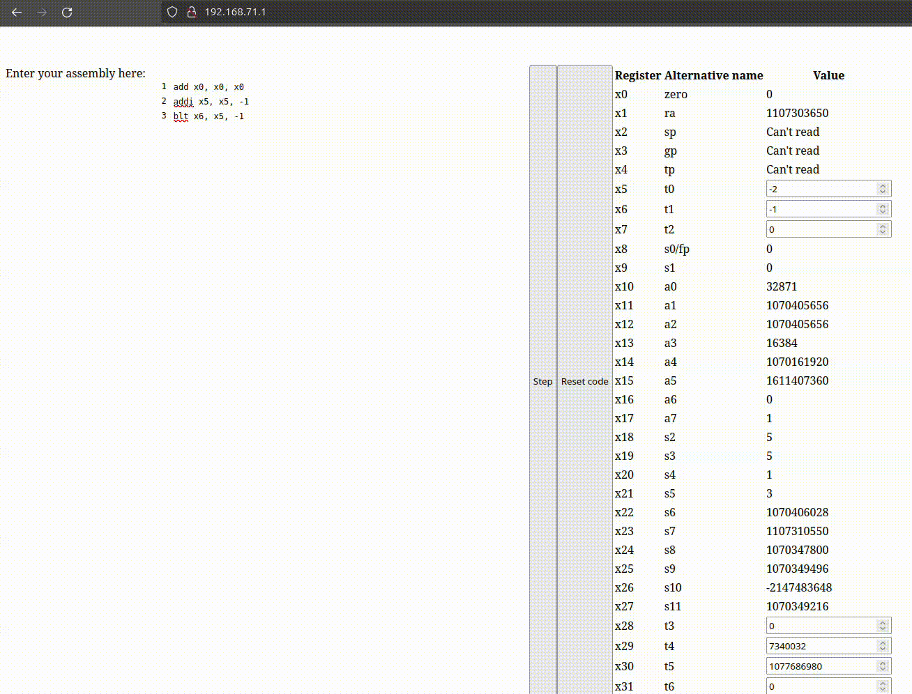

# RISC-V Executor

Inspired by https://www.cs.cornell.edu/courses/cs3410/2019sp/riscv/interpreter/ but I wanted to run the instructions on ESP32 C3 hardware.

## Instructions
Supported instrutions are add, addi and blt. Branching instructions are not executed on the hardware bu in software, to be able to step though the program more easily.

## Networking code
It's a mess, don't take inspiration from it, it's just to hook everything up.

### Demo

